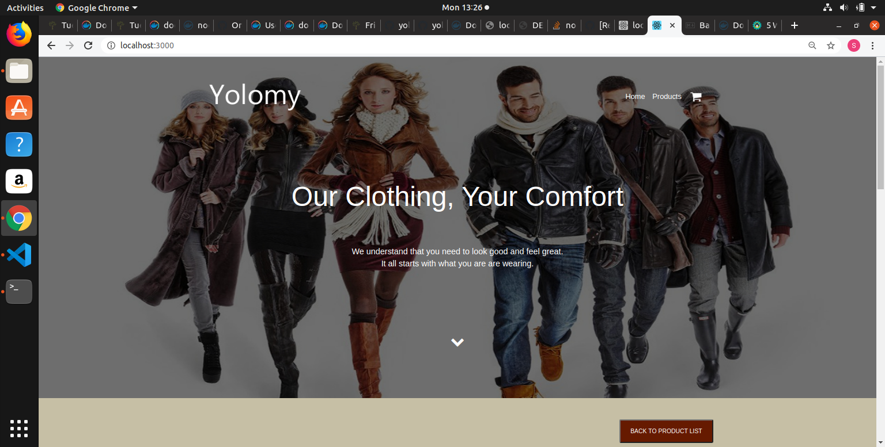

## Base image 
14.11.0-alpine3.10 - Alpine Linux is much smaller, and thus leads to much slimmer images in general.

## Dockerfile directives
The docker-compose file  creates three containers

1. *yolomy_client* - client service running on port 3000
1. *yolomy_backend* - backend service which running on port 5000
1. *mongo* -  mongo db running on port 27017

 WORKDIR /opt/yolo/backend & /opt/yolo/client - a working directory to hold application code for backend and client respectively  
COPY package*.json ./ - Copy package.json and package-lock.json files to the working directory  
RUN npm install - Install project dependencies  
COPY . . - Copy project source code to the working directory inside the dcontainers  
RUN npm run build - Compile project for production  
EXPOSE 3000 & 5000 - Expose port for client and backend  
CMD ["node", "server.js"] or CMD [ "serve", "-s", "build", "-l", "3000" ] - Start the server 

## Networking
All containers are connected to yolo_network bridge network

## Volume definition
Mongo container has an attached volume called  yolodata

## Git workflow
## Successful running of the applications
docker-compose build
docker-compose up

## Docker image tag
1. [backend](https://hub.docker.com/repository/docker/msitienei/yolo_backend "Backend repository")
1. [client](https://hub.docker.com/repository/docker/msitienei/yolo_client "Client repository")